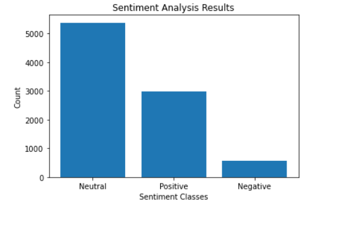
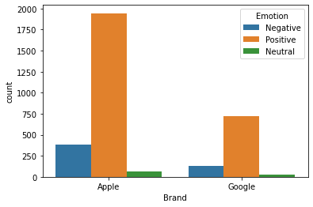
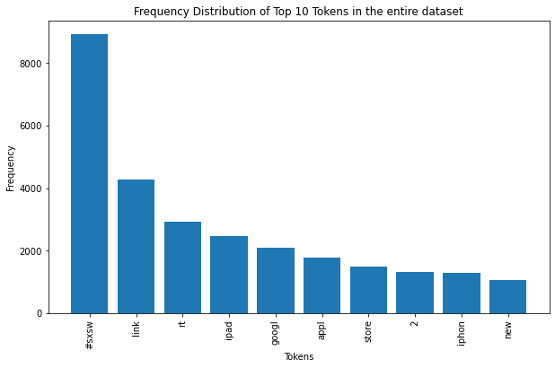
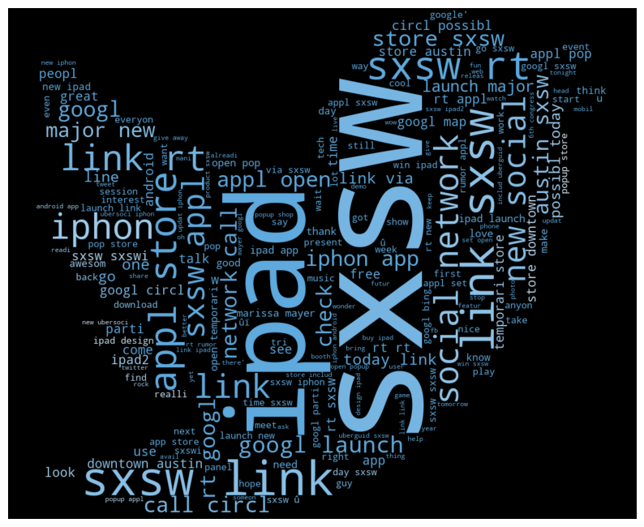
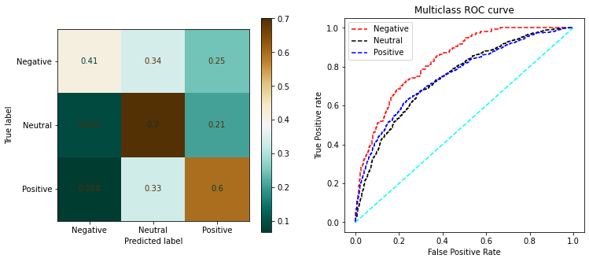
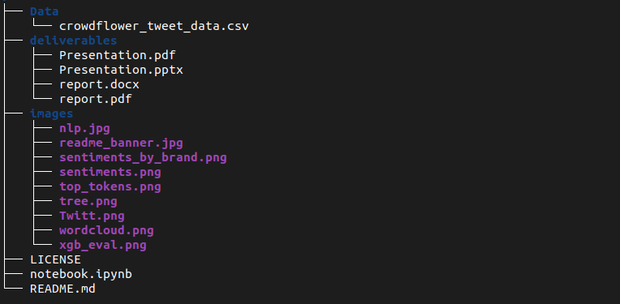

# Google/Apple product Tweet Sentiments Analysis
Sentiment Analysis on tweets curated by Crowdflower.

    

## Problem statement

In the era of social media, it is crucial for businesses to understand the sentiments expressed by customers towards their brands or products.
This sentiment analysis project aims to analyze Twitter data and extract valuable insights regarding the sentiments associated with Apple and Google products mentioned in tweets.

## Objectives

Our main objective is to create a model that when given a tweet or series of tweets and a product would determine how the user felt about that product. 

## Data Understanding

We will be using a dataset from data.world provided by CrowdFlower which has tweets about Apple and Google from the South by Southwest (SXSW) conference. It can be found from data world [here](https://data.world/crowdflower/brands-and-product-emotions)

Some initial analysis on the sentiments yielded that most reviews are neutral, with a decent number of Positive reviews and few negative results.

    

Since the data set compares sentiments by brand for products from **Google** and **Apple** comparison of sentiments by brand yielded the following results:

    

The frequency distribution for the top tokens 10 most occuring tokens is shown below.

    

    <b>Word Cloud</b>
    

### Summary of Sentiments from EDA

**Praises** of Apple Products:

* The ipad 2 was launched and customers seemed to enjoy the improvement in     design made over the ipad.
* The new iphone cases released during the SXSW Conference recieved a lot of attention on the tweets and the comments were generally very positive.
* There was a tweet thread of 'iphone vs android' and iphone was the more popular choice among users.
* The pop-up store in Austin created a lot of attention on the tweets and users in that area generally enjoyed the experience there.

**Complaints** of Apple Products:

* The battery life of the iphone was a major source of complaint. Users complained that it does not last a whole day.
* The apple music app was described by some users as "one of the worst apps I have had to use in a long time"
* The increase in size of the new ipad 2 was disapproved by some users as 'too big'

**Praises** of Google Products:

* The PacMan app on Android Opertaing system was praised.
* Users were very interested in Google maps and it proved to be the most popular Maps application with Marrissa Mayer stating that, "Usage of google maps surpused online use in the past couple of months" and that there were 150 million google map users.
* Google chrome browser had positive reviews when compared to Windows explorer with one user explaining that, "The switch is done immediately they buy a new laptop"
* A new Circle social media app the was roumoured to be launched created a lot of excitement among twitter users ahead of the launch event

**Complaints** of Google Products:

* The Android operating system was the biggest pain point for most users who tweeted with bugs being the major source of concern, one user describing the experience as 'Painful'
* Samsung products have been mentioned with the Android discussion and users stated that its implementation of android was better than that in google devices. 
* Customer service at google was an issue with users complaining of a lack of refunds when returning faulty devices e.g the Nexus smartphone

## Modelling Results

We first engineered the problem into a binary classification problem by Oversampling from the `Positive` and `Negative` sentiments only and modeling using test and train data drawn from these samples. 
After which we moved on to a build and evaluate multiple multi-class classifiers.
- The best model obtained during the modelling and model evaluation process was **XGBoostClassifier** with a training score of 84% and test score of 64%

We were able to reduce overfitting to some acceptable level through hyperparameter tuning although some accuracy was lost.

    

However we would deploy the logistic regression due to its higher accuracy: `67%`

## Challenges

* One of the first blaringly obvious challenges of the project was the small size of dataset. This meant we are limited in how much we can fit the data to a model yet still be able to generalize i.e *NOT* overfitting.
Some other challenges are discussed in depth in the included writeup document.

    <b>File Hierarchy</b>
    

