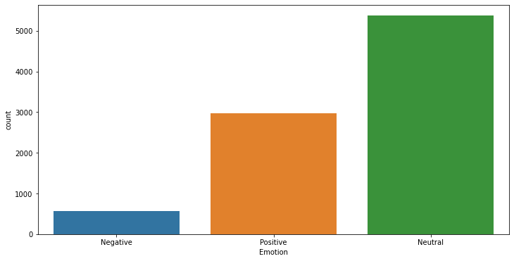

# twitter-sentiment-analysis
Sentiment Analysis on tweets curated by Crowdflower.

    

## Problem statement

In the era of social media, it is crucial for businesses to understand the sentiments expressed by customers towards their brands or products.
This sentiment analysis project aims to analyze Twitter data and extract valuable insights regarding the sentiments associated with Apple and Google products mentioned in tweets.

## Objectives

Our main objective is to create a model that when given a tweet or series of tweets and a product would determine how the user felt about that product. 

## Data Understanding

We will be using a dataset from data.world provided by CrowdFlower which has tweets about Apple and Google from the South by Southwest (SXSW) conference. It can be found from data world (here).[https://data.world/crowdflower/brands-and-product-emotions]

Some initial analysis on the sentiments yielded that most reviews are neutral, with a decent number of Positive reviews and few negative results.

    

